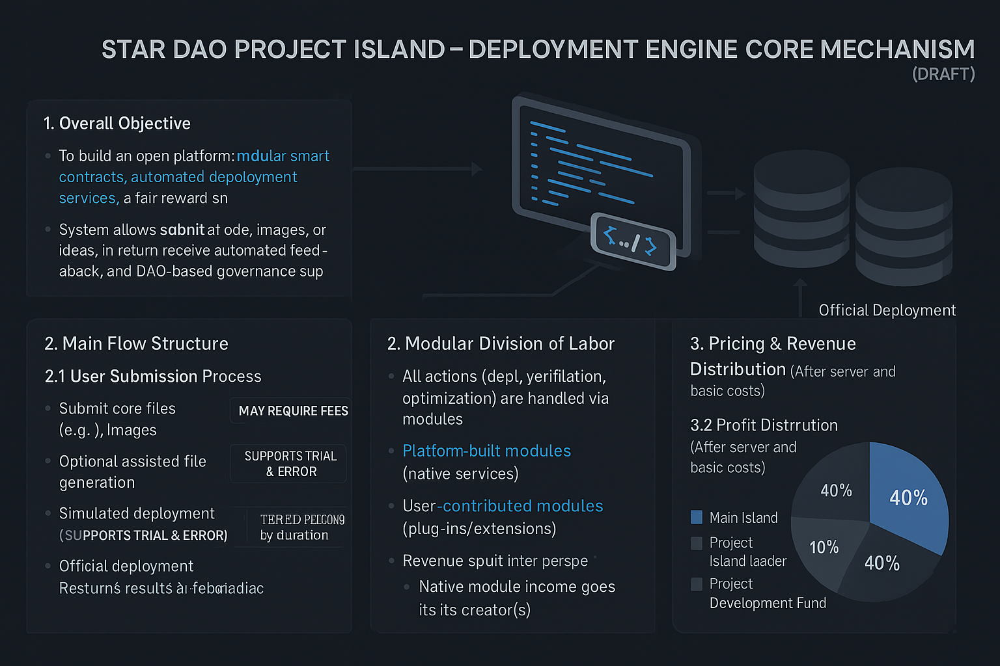

# STARDAO Project Island – Deployment Engine (Draft Phase)

This is the core deployment module for STARDAO's modular platform.  
It allows anyone to submit code, files, or creative ideas and receive automated deployment services, DAO governance support, and fair revenue distribution.
---
## 🔧 Key Features
 Modular deployment (smart contracts, automation, plug-ins)
- Transparent revenue-sharing system
- Simulated deployment (trial & error supported)
- Visual diagram included for clarity

## 📄 Files

📄 [View Full Mechanism (Markdown)](CORE_MECHANISM.md)

